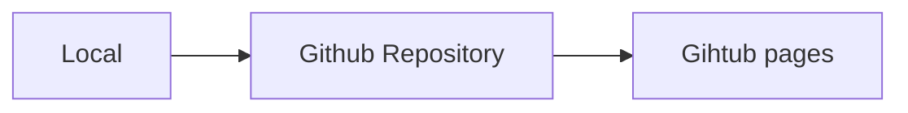

# マークダウンの書き方

書き方を制限してしまうことは、書き手にストレスを与えてしまうので以下の３つを運用ルールとして設定することをお勧めします。

- 冗長に書かない、短い言葉で優しく伝える。
- 「~です。」「~ます。」など文章は敬体で書く。
- 説明が複雑になる場合は、図の挿入または外部リンク先を貼る。

## フォーマット

.md ファイルに以下の**メタ情報を一番上に必ずつけて記述**するようにしてください。

```markdown
↓ 以下のメタ情報を一番上に記述する

---

title: '記事のタイトル'
metaTitle: 'NakedDoc | 記事のタイトル'
metaDescription: '記事の説明'

---

伝えたい記事を書く
```

## マークダウンの文法

[「Qiita マークダウン記法 一覧表・チートシート」](https://qiita.com/kamorits/items/6f342da395ad57468ae3)を参考にしてください。

## 画像の挿入

必要に応じて、ドキュメント内に画像を挿入する必要があるかと思います。  
Github の issue から画像リンクを生成する方法を推奨します。


## グラフや図の挿入

Naked Docでは[mermaid](https://mermaid-js.github.io/mermaid/)というマークダウンでグラフや図を挿入する方法をサポートしています。

